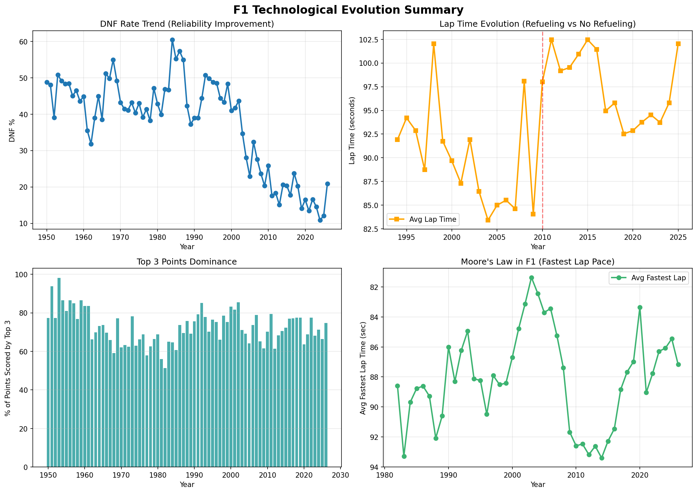
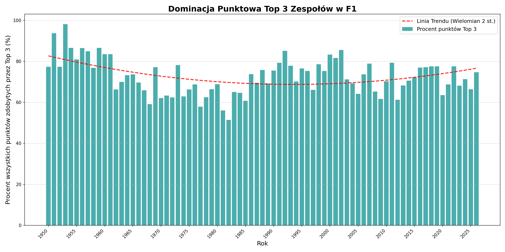
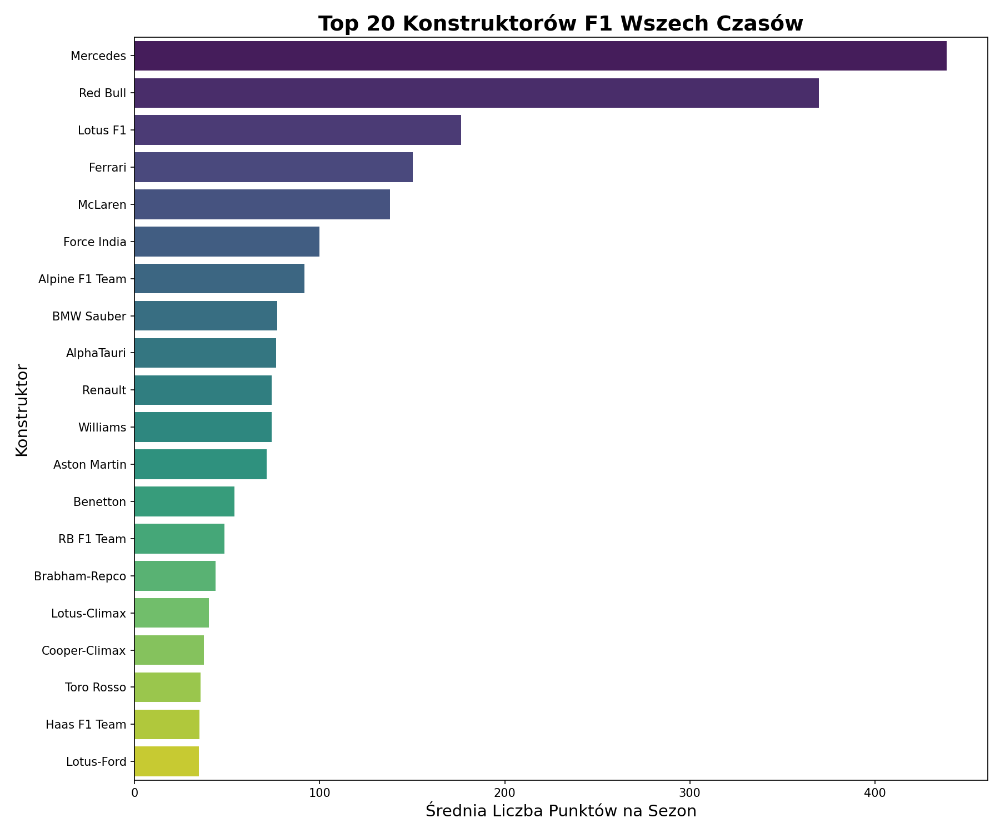
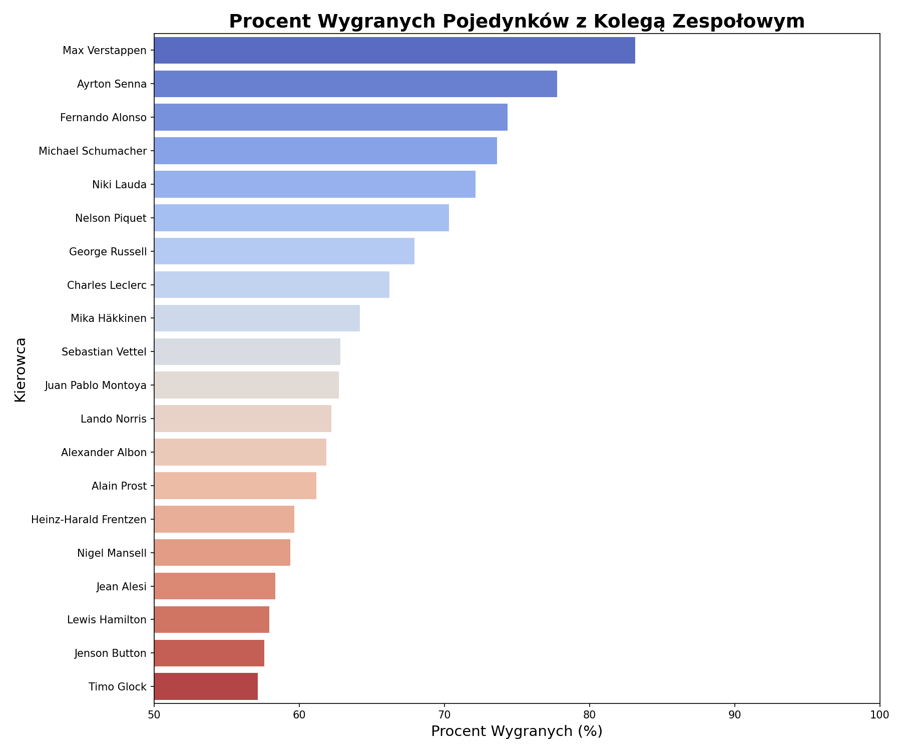
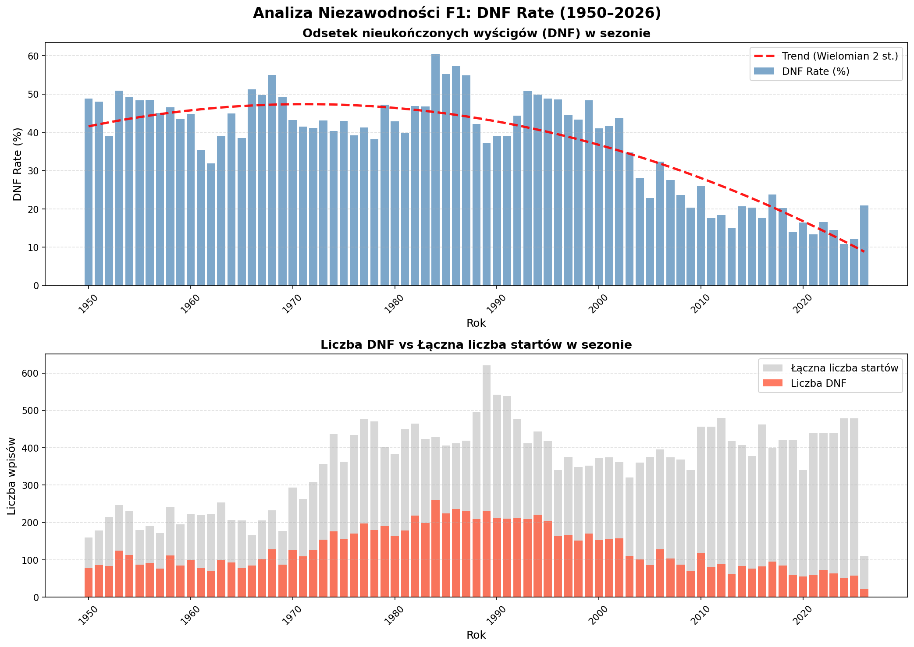
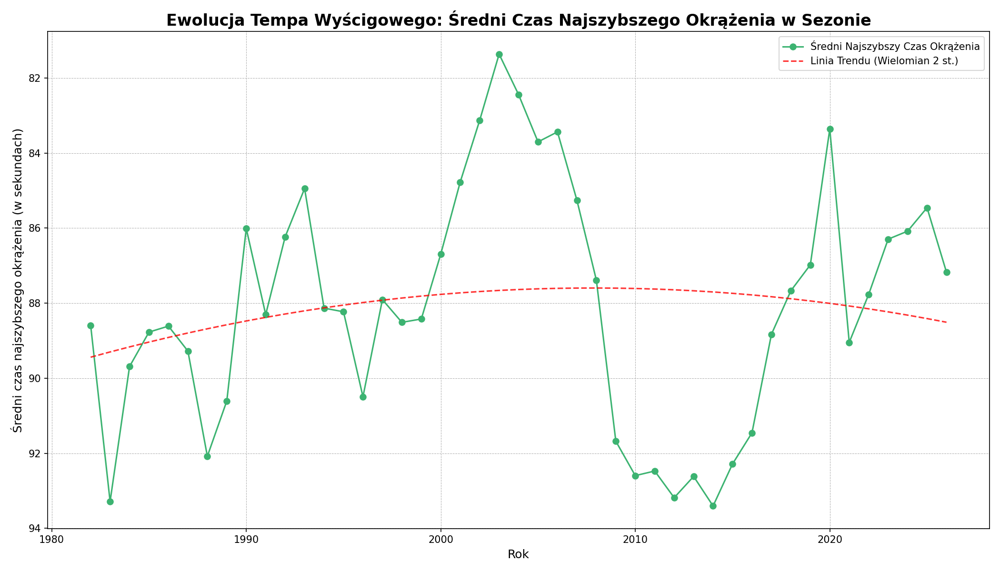
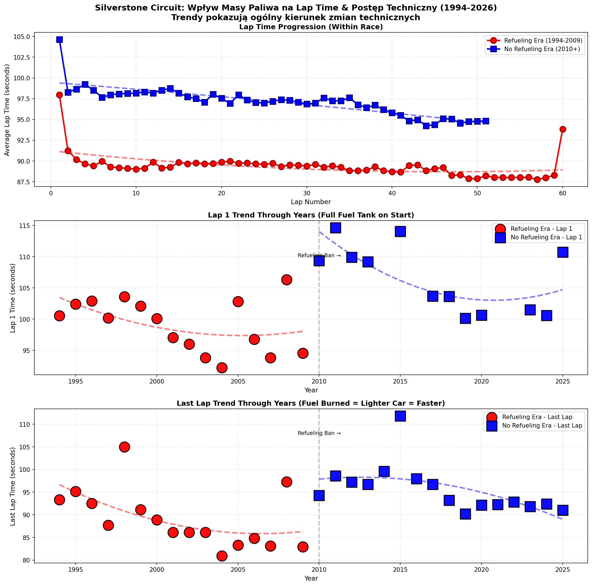
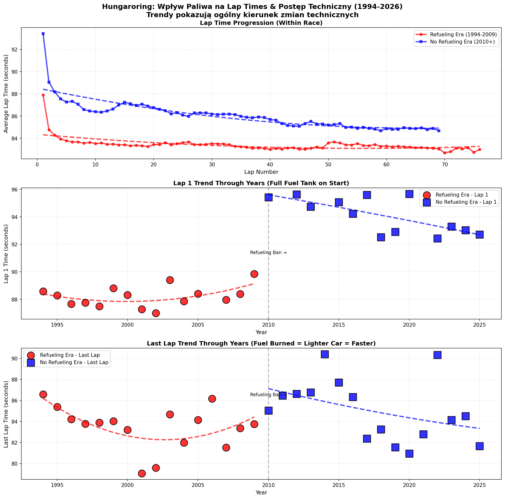

# Analiza Danych Formuły 1
## Ewolucja technologiczna w ponad 70 latach wyścigów

  Igor Barcik · Łukasz Domagała · Informatyka · 2026

  Dane: Kaggle (Ergast) F1 dataset · Python · DuckDB · matplotlib

<!--
Zacznij od pytania przewodniego: jak innowacje techniczne zmieniły osiągi, niezawodność i konkurencyjność w F1 od 1950 roku? Powiedz, że cały pipeline jest wasz: pliki CSV załadowane do DuckDB, zapytania SQL, wykresy w matplotlib. Sześć analiz, jeden zbiór danych.
-->

---
layout: default
---

# Plan prezentacji

1. Zbiór danych i metodologia
2. Dominacja zespołów na przestrzeni lat
3. Najlepsi konstruktorzy (punkty na sezon)
4. Pojedynki kierowców z tego samego zespołu
5. Niezawodność — historia DNF-ów
6. Czysty czas — czy obowiązuje „prawo Moore'a"?
7. Wpływ masy paliwa na czas okrążenia
8. Główne wnioski i ograniczenia

<!--
20-sekundowe wprowadzenie. Zaznacz, że trzy najważniejsze wyniki to niezawodność, efekt masy paliwa i cykl dominacji — i że uczciwie omówicie ograniczenia zastosowanych metryk.
-->

---
layout: section
---

# 1 · Zbiór Danych i Metodologia

---
layout: default
---

# Przegląd analizy

  
  
<b>Źródło:</b> dane Kaggle/Ergast F1 (1950–2026) w DuckDB. Cztery główne sygnały: niezawodność, osiągi, dominacja top-3 oraz wpływ zakazu tankowania w 2010 roku.

<!--
Metodologia: CSV-y → tabele DuckDB (races, results, lap_times, drivers, constructors, status), zapytania SQL, wykresy matplotlib. Zakres czasowy różni się w zależności od metryki: wykresy oparte na wynikach — 1950–2026; czasy okrążeń — od 1994; najszybsze okrążenia — od ok. 1982 (wtedy zaczęto rejestrować dane okrążeniowe). Pomarańczowy panel czasów to wyłącznie Silverstone; zielony panel najszybszych okrążeń miesza wszystkie tory — zaznacz to, żeby nikt nie wyciągał za daleko idących wniosków.
-->

---
layout: section
---

# 2 · Dominacja i Osiągi

---
layout: default
---

# Dominacja top-3 na przestrzeni lat

  
  
<b>Wniosek:</b> Trzy czołowe zespoły zgarniają co sezon ~70–80% wszystkich punktów. Koncentracja była najwyższa w latach 50. (~98% w 1952), spadła do ~51% na początku lat 80. i od tamtej pory ponownie rośnie.

<!--
To jest UDZIAŁ w danym roku (punkty top-3 / wszystkie punkty), więc inflacja systemu punktowego go nie zniekształca — to jego główna zaleta. Przerywana linia to wielomian 2. stopnia: płytkie U. Historia: wczesne stawki były małe i nierównomierne, pole się wyrównało w połowie epoki, a era hybrydowa znów skoncentrowała dominację. Dobre miejsce, by wspomnieć o Mercedesie 2014–2020 i ostatnich sezonach Red Bulla.
-->

---
layout: default
---

# Najlepsi konstruktorzy — punkty na sezon

  
  
<b>Wniosek — czytaj ostrożnie:</b> Mercedes (~440) i Red Bull (~370) mają najwyższą średnią punktów na sezon, ale ta metryka faworyzuje współczesną erę wysokiej punktacji — przez co wypada korzystniej niż Ferrari (~150) czy inne historyczne marki z długą obecnością w F1.

<!--
To najważniejsze zastrzeżenie w całej prezentacji. Metryka = suma punktów / liczba sezonów (min. 3 sezony). System punktowy ogromnie się rozrósł: wygrana w latach 50. to ok. 8 pkt, punktowało kilku kierowców; dziś wygrana to 25 pkt, punktuje top 10 plus bonus za najszybsze okrążenie i sprint. Dlatego zespoły działające tylko w ostatnich latach (np. „Lotus F1", ekipa z Enstone 2012–2015, ~175 pkt/sezon) plasują się wyżej niż Ferrari, które ciągną w dół dekady w erze niskiej punktacji. Bądź precyzyjny: ta metryka mierzy tempo zdobywania punktów we współczesnym systemie — NIE historyczną wielkość ani liczbę tytułów. Jeśli ktoś zapyta, jak to naprawić: znormalizuj punkty w ramach każdego sezonu albo użyj liczby mistrzostw/współczynnika wygranych wyścigów.
-->

---
layout: section
---

# 3 · Pojedynki Kierowców

---
layout: default
---

# Pojedynki w zespole

  
  
<b>Wniosek:</b> Verstappen wysuwa się na prowadzenie w pojedynkach z kolegą z zespołu (~83%); Hamilton wypada nisko (~58%) — metryka uwzględnia jednak tylko wyścigi ukończone przez obu kierowców i nie bierze pod uwagę poziomu rywala.

<!--
Metodologia: dla każdego wyścigu, w którym zespół miał dokładnie dwóch sklasyfikowanych kierowców, wyżej sklasyfikowany wygrywa pojedynek; liczymy % wygranych spośród wszystkich takich wyścigów; kierowcy z min. 50 sparowanymi wyścigami, top 20. Dlaczego ranking może być mylący: premiuje kierowców ze słabszymi kolegami z zespołu (Verstappen vs Gasly/Albon/Perez) i dyskryminuje tych, którzy mierzyli się z silnymi rywalami (Hamilton vs Alonso, Button, Rosberg, Russell). Metryka mierzy więc „jak często biłeś konkretnego kolegę" — nie absolutny poziom. Uwaga: liczymy wyłącznie wyścigi ukończone przez obu, DNF-y są wykluczone. Dobry punkt do Q&A — poziom rywali nie jest ważony.
-->

---
layout: section
---

# 4 · Niezawodność

---
layout: default
---

# Trendy DNF i niezawodności

  
  
<b>Wniosek:</b> Sezonowy wskaźnik DNF spadł ze szczytu ~47% (koniec lat 60.) do ok. 10–15% dziś — ukończenie wyścigu zmieniło się z rzutu monetą w rutynę. To najwyraźniejszy dowód postępu technicznego w całym zbiorze danych.

<!--
Metodologia: DNF = status końcowy spoza listy „ukończono/sklasyfikowano"; wskaźnik = DNF / liczba startów w sezonie; trend wielomianowy 2. stopnia (parabola: rośnie, potem opada). Dwa zastrzeżenia warte wzmianki: (1) „DNF" obejmuje tu też kolizje i wypadki, nie tylko awarie mechaniczne — wskaźnik nieznacznie zawyża więc czystą niezawodność inżynierską; (2) mały wzrost na końcu wykresu to sezon 2026 — niepełny, trwający sezon z małą liczbą wyścigów, a nie rzeczywisty regres niezawodności. Dolne słupki pokazują bezwzględną liczbę DNF-ów vs starty, żeby wskaźnik nie był tylko artefaktem rozmiaru stawki.
-->

---
layout: section
---

# 5 · Ewolucja Osiągów

---
layout: default
---

# „Prawo Moore'a" najszybszych okrążeń?

  
  
<b>Wniosek:</b> Osiągi <b>nie</b> rosły liniowo — najszybsze okrążenia osiągnęły szczyt na początku lat 2000., cofnęły się po zmianach regulaminowych w 2009 i 2014 roku, a potem znów odrabiały straty. „Prawo" sprawdza się tylko połowicznie.

<!--
Oś Y jest ODWRÓCONA — niższy czas (szybciej) pojawia się wyżej. Metodologia: dla każdego wyścigu bierzemy jedno najszybsze okrążenie, uśredniamy po wszystkich wyścigach w roku, ~1982–2026. Dwa uczciwe zastrzeżenia: (1) metryka miesza tory o różnej długości, więc roczne wahania częściowo odzwierciedlają skład kalendarza, a nie czyste osiągi — czytaj trend, nie poszczególne szczyty; (2) spadki pokrywają się z resetami regulaminowymi (2009: cięcia aerodynamiczne + zakaz tankowania; 2014: cięższe hybrydy V6), po których rozwój odrabiał straty. W przeciwieństwie do tranzystorów, osiągi F1 są wielokrotnie kasowane przez przepisy.
-->

---
layout: section
---

# 6 · Strategia i Warunki

---
layout: two-cols-header
---

# Wpływ masy paliwa na czas okrążenia

W miarę jak paliwo się wypala, samochód staje się lżejszy i szybszy — efekt widoczny na obu torach, wyraźniejszy w erze bez tankowania (2010+), gdy auta startują z pełnym bakiem.

::left::

  
  
Silverstone (najczęściej goszczący wyścigi tor)

::right::

  
  
Hungaroring (drugi pod względem liczby wyścigów)

<!--
Metodologia: progresja czasów okrążeń w trakcie wyścigu, era tankowania (1994–2009, kolor czerwony) vs era bez tankowania (2010+, kolor niebieski); usuwanie wartości odstających metodą IQR; trendy wielomianowe 2. stopnia; tory dobierane automatycznie wg liczby wyścigów. Odczytuj w trzech krokach: (1) w trakcie wyścigu czasy okrążeń maleją w miarę opróżniania baku — lżejszy samochód, krótszy czas; (2) era bez tankowania jest wyraźnie wolniejsza, bo auta startują z paliwem na cały wyścig; (3) efekt powtarza się na OBU torach — to dowód, że mamy do czynienia z rzeczywistym efektem masy, a nie specyfiką jednego toru. Pionowa przerywana linia oznacza wprowadzenie zakazu tankowania w 2010 roku.
-->

---
layout: default
---

  
  
Silverstone (najczęściej ścigany tor)

---
layout: default
---

  
  
Hungaroring (2. historyczny tor)

---
layout: section
---

# Główne Wnioski

---
layout: default
---

# Co mówią nam dane

- 🔧 **Niezawodność to największy postęp** — sezonowy wskaźnik DNF spadł ok. 3–4-krotnie od lat 60.
- ⛽ **Masa paliwa ma mierzalny, powtarzalny wpływ** — widoczny na różnych torach i w różnych erach
- 🏆 **Dominacja jest cykliczna, nie jednostronna** — udział top-3 malał w połowie historii, teraz znów rośnie
- ⚖️ **Ranking „najlepszy vs kolega z zespołu" zależy od metodologii** — tylko ukończone wyścigi, siła rywala nieważona
- 📈 **Czysty czas nie rósł monotonicznie** — regulaminy zresetowały krzywą w 2009 i 2014 roku

<b>Ograniczenia:</b> punkty na sezon faworyzują współczesną erę; najszybsze okrążenia mieszają tory o różnych długościach. To analiza opisowa — predykcja na sezon 2026 to planowany kolejny krok.

<!--
Mocno postaw trzy główne wnioski: niezawodność, masa paliwa, cykl dominacji. Następnie sam wskaż ograniczenia — pokazuje to, że rozumiesz metryki, a nie tylko umiasz je narysować. Wspomnij o prognozowaniu na 2026 jako przyszłej pracy, bo notebook przygotowuje metryki, ale jeszcze ich nie modeluje.
-->

---
layout: center
class: text-center
---

# Dziękujemy

Pytania?

Igor Barcik · Łukasz Domagała · Informatyka · Dane: Kaggle / Ergast F1 dataset

<!--
Miej eksport PDF jako zapasowy. Przygotuj się na pytania: „jak zdefiniowano DNF?", „dlaczego Hamilton jest tak nisko?", „czemu Mercedes wypada tu lepiej niż Ferrari?" — notatki do każdego slajdu odpowiadają na wszystkie trzy.
-->
